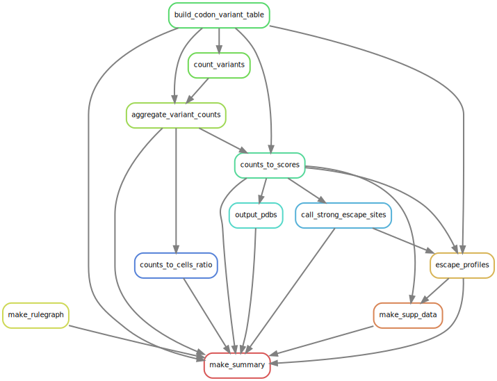

# Summary

Analysis run by [Snakefile](../../Snakefile)
using [this config file](../../config.yaml).
See the [README in the top directory](../../README.md)
for details.

Here is the rule graph of the computational workflow:

Here is the Markdown output of each notebook in the workflow:

1. [Build codon variant table](build_codon_variant_table.md)
    from input files, and get the ACE2 binding and RBD expression
    [scores](../prior_DMS_data/mutant_ACE2binding_expression.csv) for each library.

4. Count variants and then
   [aggregate counts](aggregate_variant_counts.md)
   to create [variant counts file](../counts/variant_counts_Wuhan_Hu_1.csv.gz).

5. [Analyze sequencing counts to cells ratio](counts_to_cells_ratio.md);
   this prints a list of any samples where this ratio too low. Also
   creates [a CSV](../counts/counts_to_cells_csv.csv) with the
   sequencing counts, number of sorted cells, and ratios for
   all samples.

6. [Escape scores from variant counts](counts_to_scores.md).

7. [Call sites of strong escape](call_strong_escape_sites.md),
   and write to [a CSV file](../escape_profiles/strong_escape_sites.csv).

8. Plot [escape profiles](escape_profiles.md).

9. Map escape profiles to ``*.pdb`` files using [this notebook](output_pdbs.md)

10. [Make supplementary data files](make_supp_data.md),
    which are [here](../supp_data). These include
    `dms-view` input files.